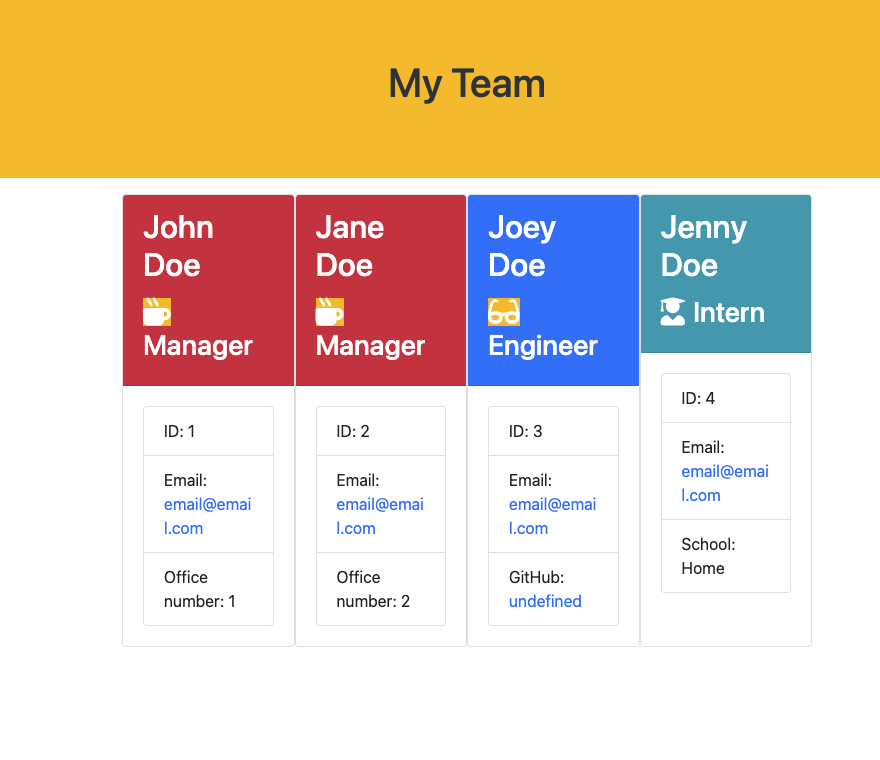

# Team Profile Generator

  

## *Description* 
    
For this assignment I created a  team generator that consist of 3 specific roles; Manager, Engineer, and Intern - via command line application. The application will prompt the user for information about the team Manager and then information about the additional team members. The user can input any number of team members, and they may be a mix of engineers and interns. Once the user is finished building their team, the application will create an HTML file that displays a dynamic team roster based on the information provided by the user.
  
  
  
## *Installation*
  
The application will be invoked by using the following command:
(npm install inquirer)
  
      
      
## *Technologies*
      
- HTML
- CSS
- JavaScript
- JQuery
- Node.js
- NPM (Inquirer)
       
  
  
## *Usage* 
 > https://github.com/JRLaro/teamProfileGenerator/tree/main/assets
 

  
## *How to Use*
 In order for the User to use, they must open the "teamProfileGenerator" from the command line and or via VScode. Then the User must open the integrated terminal follow by npm i. (This will install "inquirer") then they will ("node app.js") -> which will execute the prompts. Once completed the User will search the output folder where they will find the team.html file that was generated. 

## *Author Info*  
  
> Email: joselarojr@gmail.com
- GitHub User: JRLaro
  
## *Credits // License*
      
No collaborators were harmed in the making of this application

> MIT License
Copyright (©) 2020, J.Laro

Permission is hereby granted, free of charge, to any person obtaining a copy of this software and associated documentation files (the "Software"), to deal in the Software without restriction, including without limitation the rights to use, copy, modify, merge, publish, distribute, sublicense, and/or sell copies of the Software, and to permit persons to whom the Software is furnished to do so, subject to the following conditions:

The above copyright notice and this permission notice shall be included in all copies or substantial portions of the Software.

THE SOFTWARE IS PROVIDED "AS IS", WITHOUT WARRANTY OF ANY KIND, EXPRESS OR IMPLIED, INCLUDING BUT NOT LIMITED TO THE WARRANTIES OF MERCHANTABILITY, FITNESS FOR A PARTICULAR PURPOSE AND NONINFRINGEMENT. IN NO EVENT SHALL THE AUTHORS OR COPYRIGHT HOLDERS BE LIABLE FOR ANY CLAIM, DAMAGES OR OTHER LIABILITY, WHETHER IN AN ACTION OF CONTRACT, TORT OR OTHERWISE, ARISING FROM, OUT OF OR IN CONNECTION WITH THE SOFTWARE OR THE USE OR OTHER DEALINGS IN THE SOFTWARE.

https://choosealicense.com/licenses/mit/
